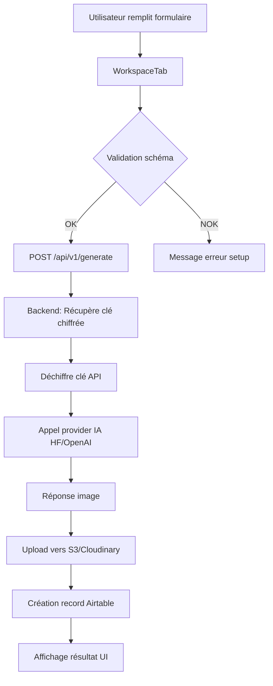
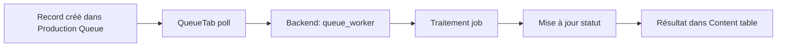

# 🔍 Analyse Complète - Projet AI Influencer Studio

## 📋 Vue d'Ensemble

**Projet** : Extension Airtable + Backend FastAPI pour génération d'influenceurs IA  
**Version** : 1.0  
**Auteur** : Glow Influ  
**Date de l'analyse** : 16 Mars 2026

---

## 🏗️ Architecture Globale

```
┌─────────────────────────────────────────────────────────────┐
│                    EXTENSION AIRTABLE                        │
│  (Frontend React - TypeScript)                              │
│  - 18 composants UI                                          │
│  - Gestion des tables & configurations                       │
│  - Interface utilisateur moderne (Dark/Light theme)          │
└────────────────────┬────────────────────────────────────────┘
                     │ HTTP/HTTPS
                     ↓
┌─────────────────────────────────────────────────────────────┐
│                    BACKEND FASTAPI                           │
│  (Python 3.11+)                                             │
│  - API REST                                                 │
│  - Orchestration des services IA                            │
│  - Stockage chiffré des clés (BYOK)                         │
│  - File d'attente & traitement asynchrone                   │
└────────────────────┬────────────────────────────────────────┘
                     │
        ┌────────────┴────────────┬──────────────┬─────────────┐
        ↓                         ↓              ↓             ↓
┌──────────────┐         ┌──────────────┐ ┌──────────┐ ┌──────────┐
│ Hugging Face │         │ AWS S3 /     │ │ Airtable │ │ Replicate│
│   API        │         │ Cloudinary   │ │   API    │ │   API    │
│              │         │              │ │          │ │          │
│ Génération   │         │  Stockage    │ │  Base de │ │  Vidéo   │
│  Images      │         │  Fichiers    │ │  données │ │          │
└──────────────┘         └──────────────┘ └──────────┘ └──────────┘
```

---

## 📁 Structure des Répertoires

### 1️⃣ **Frontend - Extension Airtable**
`C:\Users\Pret\Documents\influen_extension`

```
influen_extension/
├── frontend/                      # Code source React/TypeScript
│   ├── components/                # Composants UI (18 fichiers)
│   │   ├── Sidebar.tsx           # Navigation latérale
│   │   ├── WorkspaceTab.tsx      # Studio de contenu
│   │   ├── CreateTab.tsx         # Création influenceur
│   │   ├── LibraryTab.tsx        # Bibliothèque
│   │   ├── PromptProducerTab.tsx # Labo de prompts
│   │   ├── QueueTab.tsx          # File de production
│   │   ├── StorageTab.tsx        # Connexions & secrets
│   │   ├── DashboardTab.tsx      # Tableau de bord
│   │   ├── WorkflowTab.tsx       # Workflows
│   │   ├── SetupTab.tsx          # Configuration
│   │   ├── TrainingTab.tsx       # Centre de formation
│   │   ├── ModelCatalogTab.tsx   # Catalogue modèles
│   │   ├── PlaygroundTab.tsx     # Playground
│   │   ├── EditorTab.tsx         # Éditeur
│   │   ├── EditProTab.tsx        # Édition Pro
│   │   ├── BeginnerWizardTab.tsx # Assistant débutant
│   │   ├── InstagramCFTab.tsx    # Instagram Close Friends
│   │   ├── LoraManager.tsx       # Gestion LoRA
│   │   ├── HistoryTab.tsx        # Historique
│   │   └── PresetsTab.tsx        # Préréglages
│   ├── services/                  # Services métier
│   │   ├── airtable.ts           # Service Airtable
│   │   ├── backend.ts            # Communication backend
│   │   ├── modelRegistry.ts      # Registre modèles
│   │   ├── presetRegistry.ts     # Préréglages
│   │   └── threadsQueue.ts       # File Threads
│   ├── data/                      # Données statiques
│   │   ├── lookups.ts            # Tables de référence
│   │   └── models.ts             # Modèles disponibles
│   ├── styles/                    # Styles & thèmes
│   │   └── theme.ts              # Thème sombre/clair
│   ├── types/                     # Types TypeScript
│   │   └── domain.ts             # Types métier
│   ├── utils/                     # Utilitaires
│   │   ├── apiUtils.ts           # Fonctions API
│   │   ├── promptUtils.ts        # Gestion prompts
│   │   ├── schemaAdapter.ts      # Adaptateur schéma
│   │   └── schemaGuard.ts        # Validation schéma
│   ├── workspace/                 # État global
│   │   └── workspaceStore.tsx    # Store Zustand/Context
│   ├── App.tsx                    # Composant principal
│   ├── index.tsx                  # Point d'entrée
│   └── style.css                  # Styles globaux
├── app/data/                      # Données locales
│   └── catalog.py                # Catalogue Python (?)
├── public/                        # Assets publics
│   └── icon.svg                  # Icône extension
├── .block/remote.json            # Config remote block
├── block.json                    # Manifeste Airtable
├── package.json                  # Dépendances NPM
└── tsconfig.json                 # Config TypeScript
```

**Technologies Frontend :**
- React 16.14.0
- TypeScript 5.9.3
- TailwindCSS 3.4.0
- Airtable Blocks SDK 1.18.2
- Jest 29.5.0 (tests)

---

### 2️⃣ **Backend - API FastAPI**
`C:\Users\Pret\Documents\Backend airtable -claude`

```
backend-fastapi/
├── app/
│   ├── api/v1/endpoints/         # Endpoints API
│   │   └── generate.py           # Génération images/vidéos
│   ├── core/                     # Configuration coeur
│   │   ├── config.py             # Variables d'environnement
│   │   └── security.py           # Sécurité & authentification
│   ├── models/                   # Modèles de données
│   │   └── schemas.py            # Schémas Pydantic
│   ├── services/                 # Services métier (22 fichiers !)
│   │   ├── ai_providers/         # Providers IA (11 fichiers)
│   │   │   ├── base.py           # Interface de base
│   │   │   ├── huggingface.py    # HF Inference API
│   │   │   ├── openai.py         # OpenAI GPT/DALL-E
│   │   │   ├── gemini.py         # Google Gemini
│   │   │   ├── openrouter.py     # OpenRouter
│   │   │   ├── replicate.py      # Replicate (vidéo)
│   │   │   ├── fal.py            # Fal.ai
│   │   │   └── ...               # Autres providers
│   │   ├── storage/              # Stockage (4 fichiers)
│   │   │   ├── s3.py             # AWS S3
│   │   │   ├── cloudinary.py     # Cloudinary
│   │   │   └── gcs.py            # Google Cloud Storage
│   │   ├── database/             # Bases de données
│   │   │   ├── airtable.py       # Service Airtable
│   │   │   └── sqlite.py         # SQLite local
│   │   ├── connections_store.py  # Stockage clés chiffrées (BYOK)
│   │   ├── storage_config_store.py # Config stockage
│   │   ├── prompt_generator.py   # Génération de prompts
│   │   ├── assistant_chat.py     # Chat assistant (24KB!)
│   │   ├── queue_worker.py       # Worker file d'attente
│   │   ├── content_records.py    # Gestion contenu
│   │   ├── identity_store.py     # Identités
│   │   ├── memory_store.py       # Mémoire cache
│   │   ├── fanvue_client.py      # Client Fanvue (18KB!)
│   │   ├── fanvue_store.py       # Stockage Fanvue
│   │   ├── instagram_cf_jobs.py  # Jobs Instagram CF
│   │   ├── threads_jobs.py       # Jobs Threads (17KB!)
│   │   ├── telegram_store.py     # Telegram
│   │   ├── media_intake_store.py # Intake média
│   │   ├── media_proxy.py        # Proxy média
│   │   └── openclaw_client.py    # Client OpenClaw
│   ├── utils/                    # Utilitaires
│   │   └── prompt_builder.py     # Construction prompts
│   └── main.py                   # Application principale
├── data/                         # Données persistantes
│   └── connections.db            # SQLite (clés chiffrées)
├── uploads/                      # Fichiers uploadés
├── .env                          # Variables d'environnement
├── requirements.txt              # Dépendances Python
├── Dockerfile                    # Container Docker
└── docker-compose.yml            # Docker Compose
```

**Technologies Backend :**
- FastAPI 0.104.1
- Python 3.11+
- Pydantic 2.7.4
- Uvicorn 0.24.0
- HTTPX 0.25.1 (requêtes async)
- Boto3 1.29.7 (AWS S3)
- Cloudinary 1.36.0
- PyAirtable 2.1.0
- OpenAI 1.52.0
- Civitai-py 0.1.0

---

## 🔐 Architecture de Sécurité (BYOK)

### **Bring Your Own Key (BYOK)**

Pour respecter les exigences du Marketplace Airtable :

```
┌──────────────┐
│   Utilisateur│
│  entre clé   │
│   dans UI    │
└──────┬───────┘
       │ POST /connections/save
       ↓
┌──────────────────────────────┐
│       Backend FastAPI        │
│  1. Reçoit la clé API        │
│  2. Chiffre avec Fernet      │
│     (AES-256)                │
│  3. Sauvegarde dans SQLite   │
│     mapé sur org_id          │
└──────┬───────────────────────┘
       │
       ↓
┌──────────────────────────────┐
│  data/connections.db         │
│  - Clé chiffrée              │
│  - Liée à org_id (Base ID)   │
│  - Jamais dans GlobalConfig  │
└──────────────────────────────┘

Lors d'une génération :
1. Récupération depuis SQLite
2. Déchiffrement à la volée
3. Utilisation pour appel API
4. Clé jamais exposée à Airtable
```

**Fichier clé** : `connections_store.py` (3.5KB)
- Utilise Fernet (cryptography)
- Master key : `CONNECTIONS_MASTER_KEY`
- Stockage par organisation (org_id)

---

## 🎯 Fonctionnalités Principales

### **Frontend - 18 Onglets**

| Onglet | Fichier | Description |
|--------|---------|-------------|
| **Setup** | `SetupTab.tsx` | Configuration tables & champs |
| **Workspace** | `WorkspaceTab.tsx` | Studio de création contenu |
| **Create** | `BeginnerWizardTab.tsx` | Assistant création influenceur |
| **Library** | `LibraryTab.tsx` | Bibliothèque influenceurs |
| **Prompts** | `PromptProducerTab.tsx` | Créateur de prompts |
| **Production** | `QueueTab.tsx` | File d'attente travaux |
| **Assets** | `LoraManager.tsx` | Gestion modèles LoRA |
| **Storage** | `StorageTab.tsx` | Connexions providers (BYOK) |
| **Dashboard** | `DashboardTab.tsx` | Statistiques & analytics |
| **Workflow** | `WorkflowTab.tsx` | Automatisation workflows |
| **Training** | `TrainingTab.tsx` | Formation modèles |
| **Catalog** | `ModelCatalogTab.tsx` | Catalogue modèles IA |
| **Playground** | `PlaygroundTab.tsx` | Test & expérimentation |
| **Editor** | `EditorTab.tsx` | Éditeur simple |
| **Edit Pro** | `EditProTab.tsx` | Éditeur avancé |
| **History** | `HistoryTab.tsx` | Historique générations |
| **Presets** | `PresetsTab.tsx` | Préréglages usine |
| **Instagram CF** | `InstagramCFTab.tsx` | Instagram Close Friends |

### **Backend - Services**

#### **AI Providers (11 providers)**
- ✅ Hugging Face (principal)
- ✅ OpenAI (GPT, DALL-E)
- ✅ Google Gemini
- ✅ OpenRouter
- ✅ Replicate (vidéo)
- ✅ Fal.ai
- ⚠️ Kling (vidéo - placeholder)
- ⚠️ Luma (vidéo - placeholder)

#### **Storage Providers**
- AWS S3
- Cloudinary
- Google Cloud Storage
- Local (développement)

#### **Services Métier**
- Airtable CRUD
- File d'attente (queue_worker)
- Génération prompts
- Chat assistant
- Intégration Fanvue
- Instagram Close Friends
- Threads jobs
- Telegram
- Cache mémoire

---

## 🔄 Flux de Travail Typique

### **Création d'un Influenceur**



### **File d'Attente (Queue System)**



---

## 📊 État du Code

### **Frontend**
- ✅ 18 composants React bien structurés
- ✅ TypeScript avec typage fort
- ✅ Tests Jest configurés
- ✅ Thème sombre/clair dynamique
- ✅ Intégration TailwindCSS
- ✅ State management avec WorkspaceProvider
- ✅ Registry de modèles dynamique

### **Backend**
- ✅ Architecture modulaire propre
- ✅ 22 services bien organisés
- ✅ Sécurité BYOK implémentée
- ✅ Support multi-providers
- ✅ Documentation Swagger auto
- ✅ Docker & Docker Compose
- ⚠️ Quelques placeholders (vidéo)

---

## 🚀 Roadmap & Optimisations

### **1. Caching Backend** ⏳
- **Idée** : Redis ou cache local
- **Pourquoi** : Réduire coûts API et latence
- **Priorité** : Haute

### **2. Génération Vidéo** 🎬
- **Status** : Placeholders existants
- **Action** : Implémenter polling Kling/Luma
- **Défi** : Temps de génération > 1 min

### **3. Feedback Erreurs** 💬
- **Action** : Améliorer bouton "Test" StorageTab
- **Actuel** : Message générique "Error"
- **Cible** : Messages spécifiques (ex: "Insufficient Credits")

### **4. Monitoring** 📈
- **Ajouter** : Prometheus + Grafana
- **Métriques** : Temps réponse, coûts, erreurs
- **Logs** : Centraliser avec ELK stack

### **5. Rate Limiting** 🛑
- **Nécessaire** : Protéger contre abus
- **Implémentation** : SlowAPI ou middleware custom

---

## 🔧 Checklist Déploiement

### **Render (Backend)**
- [ ] `CONNECTIONS_MASTER_KEY` dans env vars
- [ ] Monter `data/` sur disque persistant
- [ ] Build command: `pip install -r requirements.txt`
- [ ] Start command: `uvicorn app.main:app --host 0.0.0.0 --port $PORT`

### **Airtable Marketplace**
- [ ] Vérifier scopes dans `block.json`
- [ ] Privacy Policy hébergée
- [ ] Terms of Service à jour
- [ ] Screenshots démo
- [ ] Vidéo démo (optionnel)

### **Sécurité**
- [ ] HTTPS activé (Render gère)
- [ ] Clés API tournées régulièrement
- [ ] Logs sans données sensibles
- [ ] Rate limiting activé

---

## 📈 Métriques du Projet

### **Code Volume**
- **Frontend** : ~15-20K lignes (TSX/TS)
- **Backend** : ~10-15K lignes (Python)
- **Tests** : ~500 lignes
- **Docs** : ~2K lignes

### **Complexité**
- **Composants UI** : 18
- **Services Backend** : 22
- **Endpoints API** : ~10
- **Providers IA** : 8+

---

## 🎨 Points Forts du Projet

✅ **Architecture propre et modulaire**  
✅ **Sécurité BYOK conforme marketplace**  
✅ **Multi-providers IA (flexibilité)**  
✅ **UI/UX soignée (thème, density)**  
✅ **TypeScript & typage fort**  
✅ **Documentation complète**  
✅ **Docker ready**  
✅ **Tests unitaires présents**  

---

## ⚠️ Points d'Attention

⚠️ **Vidéo generation** : À implémenter complètement  
⚠️ **Monitoring** : Manque dashboard prod  
⚠️ **Rate limiting** : À ajouter pour prod  
⚠️ **Backup DB** : Stratégie à définir  
⚠️ **CI/CD** : Unifié mais perfectible  

---

## 📞 Prochaines Étapes

1. **Finaliser génération vidéo** (Kling/Luma)
2. **Ajouter caching Redis**
3. **Mettre en place monitoring**
4. **Renforcer feedback erreurs UI**
5. **Préparer soumission Marketplace**

---

## 📚 Documentation Associée

- `README.md` - Guide principal backend
- `BACKEND_ARCHITECTURE.md` - Architecture détaillée
- `FRONTEND_BACKEND_CONNECTION.md` - connexion frontend/backend
- `AIRTABLE_SETUP.md` - Configuration Airtable
- `PRIVACY_POLICY.md` - Politique confidentialité
- `TERMS_OF_SERVICE.md` - Conditions utilisation
- `RUN_SERVER.md` - Démarrage serveur

---

**Analyse effectuée le** : 16 Mars 2026  
**Par** : Qoder AI Assistant  
**Version analysée** : 1.0 (main branch)
